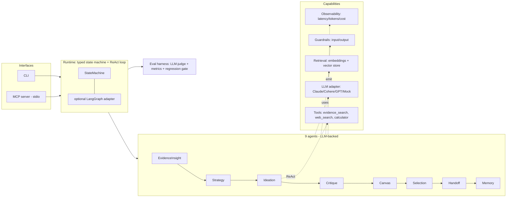

# discovery-agents

[](https://github.com/deepanshumody/discovery-agents/actions/workflows/ci.yml)
[](https://www.python.org/)
[](LICENSE)
[](https://mypy-lang.org/)
[](https://docs.astral.sh/ruff/)

> A production-grade, **LLM-powered multi-agent workflow** for enterprise product
> discovery — with **RAG**, a **ReAct tool-use loop**, a **rigorous evaluation
> harness**, **guardrails**, full **observability**, and an **MCP server**.
> **Keyless by default, real on demand.**

Given a product brief and a corpus of customer evidence, a graph of nine specialized
agents clusters the evidence into insights, generates several evidence-grounded
product directions, critiques and scores them, selects a winner, and emits a
coding-agent-ready handoff packet — every step traced, evaluated, and guarded.

**Why it's built this way.** A reviewer can run the whole thing in 30 seconds with **no
API key** (a deterministic mock provider + in-memory retrieval). Set
`ANTHROPIC_API_KEY` (or `--provider cohere`/`openai`) and the *same graph* runs on a
frontier model. CI, tests, and the eval regression gate all run keyless and
deterministically.

## 30-second quickstart (no API key)

```bash
pip install -e ".[dev]"
discovery-agents --output outputs/demo        # runs on the deterministic mock provider
discovery-agents --eval                        # run the evaluation harness + regression gate
pytest -q                                      # 56 tests, deterministic, keyless
```

`outputs/demo/` gets: `run_summary.md`, `coding_agent_handoff.md`, `canvas.html` (visual
canvas + eval dashboard + trace timeline), `agent_run.json`, and `agent_trace.md`.

## Run it on a real frontier model

```bash
pip install -e ".[anthropic]"      # or .[cohere] / .[openai]
export ANTHROPIC_API_KEY=...
discovery-agents --provider anthropic --model claude-sonnet-4-6 --output outputs/live
```

Providers are pluggable behind one `LLMClient` protocol; if a key or SDK is missing the
factory logs a warning and falls back to the mock, so the workflow always runs.

## Architecture



See [`docs/architecture.md`](docs/architecture.md) for the module-by-module breakdown.

## What's inside

- **Provider-agnostic LLM layer** (`llm/`) — one `LLMClient` protocol; deterministic
  keyless `MockLLMClient` (default) + lazy Anthropic / Cohere / OpenAI adapters with
  tool-calling and structured-output support.
- **RAG** (`retrieval/`) — `Embedder` + deterministic `HashingEmbedder`, a `VectorStore`
  (in-memory cosine + lazy Pinecone adapter), and an `EvidenceIndex` that returns cited
  passages.
- **ReAct runtime** (`runtime/`) — a typed `StateMachine` (topological ordering, cycle
  detection, a trace span per node) and an `LLMAgent` plan-execute loop with tool use,
  step budgets, and full step tracing; plus an optional **LangGraph** adapter that runs
  the same graph.
- **Tools** (`tools/`) — a `Tool` protocol + registry, a RAG `evidence_search`, a safe
  AST `calculator`, and a mockable `web_search`. See [`docs/adding-a-tool.md`](docs/adding-a-tool.md).
- **Guardrails** (`guardrails/`) — input (PII redaction, prompt-injection block) and
  output (citation-required, groundedness, schema) checks, each recorded to the trace.
- **Observability** (`observability/`) — a `Trace` of spans carrying latency, token
  usage, and cost, rendered to Markdown and an HTML timeline.
- **Evaluation** (`eval/`) — deterministic quality metrics + an **LLM-as-judge**
  (faithfulness / relevance / helpfulness), aggregated into a scorecard and gated against
  a committed `baseline.json` in CI. See [`docs/evals.md`](docs/evals.md).
- **MCP server** (`mcp_server.py`) — exposes `discovery_run`, `evidence_search`, and
  `eval_run` over stdio for Claude Desktop / Claude Code. See [`docs/mcp.md`](docs/mcp.md).

## ML-infrastructure platform (`mlinfra/`)

The retrieval embedder isn't a toy — it can be **trained** by a production ML-infra
platform and served back through the same `Embedder` protocol:

- **Distributed PyTorch training** — a custom SimCSE/InfoNCE training loop with **DDP**
  (`gloo` on CPU, `nccl` on GPU) and **fault-tolerant, resumable checkpointing**
  (atomic, SIGTERM-safe; resume reproduces the trajectory exactly — a tested invariant).
- **GPU-native data I/O** — a multi-backend **tensor archive** (`Numpy` / **Zarr** /
  **HDF5**) with a GPU-native `DataLoader`, plus an **I/O benchmark** (samples/s, MB/s,
  p50/p95) and a resource profiler.
- **Distributed data curation** — a pluggable `Executor` (Local / **Dask**) that tokenizes
  and shards a corpus into the archive.
- **MLOps** — experiment/artifact tracking (**MLflow** or a keyless JSON tracker), a
  **Dockerfile**, `docker-compose`, and a **Kubernetes** Indexed-Job training manifest.

### Benchmark result — it actually works

On a **real** task (Banking77 intent retrieval, 9,993 train / 3,076 test, 77 intents; relevant
= same intent), the trained embedder **beats the lexical baseline** — a measured, reproducible
result, not a demo ([`benchmark/RESULTS.md`](benchmark/RESULTS.md)):

| embedder | hit@1 | hit@5 | MRR | mAP |
|---|---|---|---|---|
| hashing (lexical baseline) | 0.769 | 0.922 | 0.835 | 0.503 |
| **torch (supervised contrastive)** | **0.830** | 0.911 | **0.865** | **0.775** |
| sentence-transformers (reference) | 0.921 | 0.970 | 0.942 | 0.842 |

`hit@k` = fraction of queries with ≥1 same-intent neighbor in top-k (success@k). The trained
model wins hit@1 (+6pts), MRR, and **mAP (+27pts)** over lexical (which edges it out on
hit@5/@10); a pretrained `sentence-transformers` model is the reference upper bound. Reproduce
in ~80s on CPU:

```bash
pip install -e ".[ml,dask,benchmark,st]"
python -m discovery_agents.mlinfra.cli benchmark --full --with-st   # writes benchmark/RESULTS.md
python -m discovery_agents.mlinfra.cli train --smoke                # curate -> train -> export, CPU
DISCOVERY_EMBEDDER=torch discovery-agents                           # the agent RAG uses the trained embedder
discovery-agents --dataset banking77                                # run the agents on real support messages
```

Trains **CPU-first**, but is written for multi-GPU / petabyte scale. Full details in
[`docs/ml-platform.md`](docs/ml-platform.md). *(This platform targets ML-infra roles; the agentic
stack above targets applied-AI roles — the repo serves both.)*

## How it maps to the role

This repo is organized to demonstrate the requirements of an applied-AI agentic-workflows
role; the full table is in [`docs/role-mapping.md`](docs/role-mapping.md).

| Requirement | Where |
|---|---|
| Production engineering (typed, tested, observable, CI) | strict `mypy`, `ruff`, `pytest`, GitHub Actions, `observability/` |
| Agentic architectures (ReAct / plan-execute, tools/APIs) | `runtime/agent.py`, `tools/` |
| LLM stack (Claude/GPT/Cohere, RAG, vector DBs, LangGraph) | `llm/`, `retrieval/`, `runtime/langgraph_adapter.py` |
| Rigorous evaluation (accuracy / safety / latency) | `eval/` harness + LLM-judge + CI regression gate |
| Reliable, observable, safe, auditable | `guardrails/`, `observability/`, decision memory |

## Project layout

```
src/discovery_agents/
  llm/            # LLMClient protocol, mock + Anthropic/Cohere/OpenAI adapters, factory
  retrieval/      # embeddings, vector store, evidence index (RAG)
  tools/          # Tool protocol + registry; evidence_search, calculator, web_search
  runtime/        # state machine, ReAct agent loop, discovery graph, LangGraph adapter
  agents/         # the 9 discovery agents (LLM-backed, with deterministic baselines)
  guardrails/     # input/output safety checks + pipeline
  observability/  # trace spans (latency/tokens/cost), cost table, HTML report
  eval/           # metrics, LLM-as-judge, harness, committed baseline.json
  config.py       # RunConfig (provider/model/flags), env-driven
  pipeline.py     # builds the graph + capabilities and runs it
  cli.py          # discovery-agents entry point
  mcp_server.py   # MCP server (discovery-agents-mcp)
tests/            # 56 deterministic, keyless tests
docs/             # architecture, evals, adding-a-tool, mcp, role-mapping + design specs
```

## Development

```bash
ruff check src tests && ruff format src tests   # lint + format
mypy                                            # strict type check
pytest -q                                       # tests (keyless, deterministic)
```

CI runs all of the above plus the eval regression gate on Python 3.9–3.12. See
[`CONTRIBUTING.md`](CONTRIBUTING.md).

## License

MIT — see [`LICENSE`](LICENSE).
