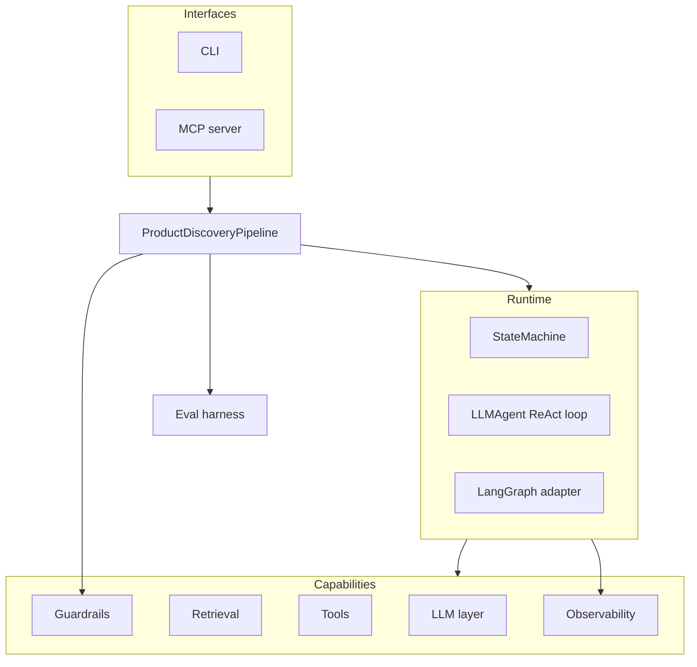

# Architecture

`discovery-agents` turns a product brief + customer evidence into evidence-grounded,
critiqued, evaluated product directions and a coding-agent handoff. It is built in layers
so each unit has one responsibility, a clear interface, and can be tested in isolation.

## Layers

### LLM layer (`llm/`)
`LLMClient` is the single protocol agents depend on: `chat(messages, *, tools,
response_format) -> LLMResponse`. Implementations:
- `MockLLMClient` — deterministic, keyless **default**. Returns no domain answer (its
  `structured` is `None`), so agents fall back to a deterministic baseline; it still
  reports estimated token usage so observability is exercised. A `script=[...]` drives
  multi-step tool-use tests.
- `AnthropicClient` (default real), `CohereClient`, `OpenAIClient` — lazy-imported, map
  the protocol onto each SDK, parse tool calls + JSON, and report real usage/latency.
- `get_client(config)` resolves the provider from env/flags and **falls back to the mock**
  when a key or SDK is missing.

### Retrieval / RAG (`retrieval/`)
`HashingEmbedder` (deterministic signed feature hashing via `hashlib`, so it is stable
across processes) → `InMemoryVectorStore` (exact cosine, deterministic tie-break; a lazy
Pinecone adapter is provided) → `EvidenceIndex` (embed → upsert → `search`/`citations`
with the evidence id as the citation id).

### Runtime (`runtime/`)
- `StateMachine` — nodes declare `requires`/`provides`; it topologically orders them,
  validates dependencies, detects cycles, and records a latency span per node.
- `LLMAgent` — a ReAct / plan-execute loop: call the model with tool specs → if it
  requests a tool, run it and append the observation → repeat until a final answer,
  `max_steps`, or a token budget. Every model + tool step is traced.
- `graph.py` wires the nine agents as nodes; `langgraph_adapter.py` runs the same graph
  through LangGraph when the extra is installed.

### Agents (`agents/`)
Nine single-purpose agents (evidence-insight, strategy, ideation, critique, canvas,
selection, handoff, eval, memory). LLM-backed agents build a prompt + JSON schema, call
the model through `BaseAgent._chat` (which records a costed span), parse the structured
result, and **fall back to a curated deterministic baseline** when the model returns
nothing valid — which is exactly what keeps the keyless path reproducible.

### Guardrails (`guardrails/`)
Input: `PiiRedactionGuard`, `PromptInjectionGuard`. Output: `CitationRequiredGuard`,
`GroundednessGuard` (rejects citations that aren't real evidence ids), `SchemaGuard`. A
`GuardrailPipeline` runs them, records a guardrail span, and reports `is_blocked`.

### Observability (`observability/`)
A `Trace` collects `TraceSpan`s (agent, op, latency, token usage, cost, tool calls,
guardrail events) and rolls up totals; renders to Markdown and an HTML timeline.

### Evaluation (`eval/`)
Deterministic metrics + an LLM-as-judge produce a `Scorecard`; `check_regression`
compares it to a committed `baseline.json` and fails CI on a real drop. See
[`evals.md`](evals.md).

## Data flow (one run)

1. Build the `EvidenceIndex` + `ToolRegistry`.
2. Input guardrails screen the brief + evidence.
3. `StateMachine` runs the graph: insights → opportunities → directions (LLM, grounded)
   → critiques → canvas → selection → handoff → evals → decision memory.
4. Output guardrails verify each direction cites real evidence.
5. The `Trace` (latency/tokens/cost) and artifacts are written; the eval harness can score
   the run and gate regressions.

## Design principles

Keyless-by-default · provider-agnostic · deterministic mock as the test oracle · cited or
flagged · everything observable · small, isolated, fully-typed units.

The original design + implementation specs live under
[`docs/superpowers/`](superpowers/).
