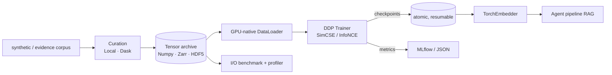

# ML-infrastructure platform

`discovery_agents.mlinfra` is a production-shaped ML platform that **trains the retrieval
embedder** the agent pipeline serves. It demonstrates distributed PyTorch training, a
multi-backend tensor archive with GPU-native loading, distributed data curation,
experiment tracking, and I/O benchmarking — **keyless and CPU-first**, architected for
multi-GPU / petabyte scale.



## Quickstart (CPU, no API key)

```bash
pip install -e ".[ml,dask]"
python -m discovery_agents.mlinfra.cli train --smoke   # curate -> train -> export, end to end
python -m discovery_agents.mlinfra.cli io-bench        # Numpy vs Zarr vs HDF5 read throughput
```

Granular commands: `curate`, `train`, `io-bench`, `benchmark`, `export` (also
`make -f deploy/Makefile <target>`).

## Headline result: Banking77 retrieval benchmark

The trained embedder is **load-bearing** — it beats the lexical baseline on a real task
([`../benchmark/RESULTS.md`](../benchmark/RESULTS.md)):

```bash
pip install -e ".[ml,dask,benchmark]"
python -m discovery_agents.mlinfra.cli benchmark --full --with-st   # ~80s on CPU
```

| embedder | recall@1 | MRR | mAP |
|---|---|---|---|
| hashing (lexical baseline) | 0.769 | 0.835 | 0.503 |
| torch (supervised contrastive) | **0.830** | **0.865** | **0.775** |
| sentence-transformers (reference) | 0.921 | 0.942 | 0.842 |

Relevant = same intent over 9,993 train / 3,076 test utterances, 77 intents. The trained model
(supervised contrastive on the platform) wins recall@1 / MRR / mAP; lexical edges out recall@5/@10
(it casts a wider lexical net), and a pretrained model is the reference upper bound — an honest,
reproducible comparison.

## Use the trained embedder in the agent pipeline

```bash
python -m discovery_agents.mlinfra.cli train          # writes outputs/ml/checkpoints/{latest.pt,vocab.json,model_config.json}
DISCOVERY_EMBEDDER=torch discovery-agents --output outputs/demo   # RAG now uses TorchEmbedder
```

`get_embedder` falls back to the deterministic `HashingEmbedder` if torch or the weights are
missing, so the default path stays keyless.

## Components

| Module | Responsibility |
|---|---|
| `mlinfra/tokenizer.py` | deterministic word vocab (PAD/UNK), fixed-length encoding |
| `mlinfra/store/` | `ArrayStore` protocol + Numpy (default) / Zarr / HDF5 backends |
| `mlinfra/curation/` | `Executor` (Local, Dask) + `CorpusCurator` writing the archive |
| `mlinfra/data/` | archive-backed `Dataset` + GPU-native `DataLoader` (pin_memory, non_blocking) |
| `mlinfra/model/` | Transformer sentence encoder + SimCSE InfoNCE loss |
| `mlinfra/train/` | DDP `Trainer`, gloo/nccl setup, atomic resumable checkpointing (SIGTERM-safe) |
| `mlinfra/tracking/` | `Tracker` protocol; JSON (default) + MLflow backends |
| `mlinfra/bench/` | backend I/O benchmark + `ResourceSampler` profiler |
| `mlinfra/embedder.py` | `TorchEmbedder` implementing the retrieval `Embedder` protocol |

## Distributed training

```bash
# Local multi-process DDP via torchrun (CPU/gloo):
torchrun --nproc-per-node=2 -m discovery_agents.mlinfra.cli train
```

On Kubernetes, `deploy/k8s/train-job.yaml` runs an Indexed Job (one pod per DDP node) with a
headless Service for rendezvous; `deploy/docker-compose.yml` runs a local trainer + MLflow.

## Scaling notes (what changes for real scale)

| Concern | This repo (demo) | At scale |
|---|---|---|
| Hardware | CPU, `gloo` | multi-GPU, `nccl`; FSDP for sharding (future work) |
| Tensor store | Numpy / Zarr / HDF5, local | Zarr/TensorStore on object storage; sharded chunks |
| Curation | Local / Dask (threaded) | Dask/Ray cluster (`distributed.Client`) — Ray is future work |
| Data | synthetic corpus | real petabyte corpora, streaming/iterable datasets |
| Tracking | JSON / local MLflow | MLflow tracking server + artifact store |

Design specs and the staged plan live under [`docs/superpowers/`](superpowers/).
