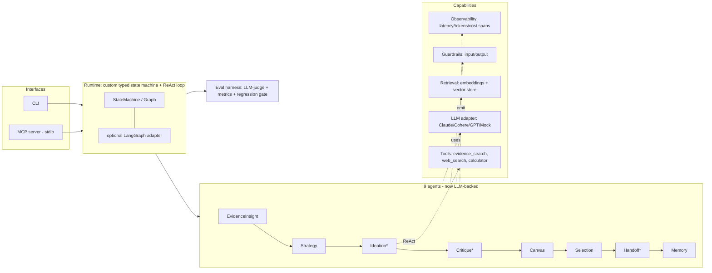

# Design: LLM-Powered Agentic Workflow Upgrade

- **Date:** 2026-06-01
- **Status:** Approved (full flagship)
- **Author:** Deepanshu Mody
- **Target role this portfolio supports:** Cohere — *Applied AI Engineer, Agentic Workflows*

## 1. Context & motivation

`discovery-agents` today is a clean, well-structured **multi-agent product-discovery
pipeline**: nine small single-purpose agents (evidence → insights → strategy → ideation →
critique → canvas → selection → handoff → eval → memory), a `BaseAgent`/`AgentTrace` core,
dataclass domain models, Markdown/HTML/JSON renderers, a CLI, and a passing smoke test. The
architecture instinct is correct: traceable, eval-aware, and oriented around a coding-agent
handoff.

The gap, for an Applied AI Engineer reviewer at a frontier-model company, is that **the
pipeline never calls an LLM** — every agent is deterministic/hardcoded (e.g. `IdeationAgent`
returns five fixed directions; critique scores are heuristics). It also lacks real tool use,
retrieval/RAG, a rigorous evaluation framework, guardrails, production-grade observability,
CI/typing, and meaningful docs. The sample data is "Remy-style," reading as built for a
different company.

This design upgrades the existing pipeline into a **production-grade, LLM-powered,
evaluated, observable multi-agent workflow** — keeping the architecture and the
product-discovery concept, but making it real and enterprise-framed.

## 2. Goals / non-goals

### Goals
- Make the nine agents **actually call a frontier LLM** through a provider-agnostic adapter
  (default **Anthropic Claude**; adapters for Cohere Command and OpenAI GPT).
- Stay **keyless-by-default**: the demo, tests, and CI run with **zero API keys** via a
  deterministic `MockLLMClient` + in-memory hashing retrieval. Real models activate purely by
  setting an env var / CLI flag.
- Add a **ReAct / plan-execute agent loop** with **tool use** (the JD names ReAct,
  Plan-and-Execute, tools/APIs).
- Add **RAG**: embeddings + a vector store with citation tracking (the JD names RAG and
  Pinecone/Weaviate).
- Add a **rigorous evaluation harness**: deterministic metrics + **LLM-as-judge** +
  latency/cost/safety + a committed baseline with **regression gating in CI**.
- Add **guardrails** (input + output) and **observability** (per-span latency/tokens/cost).
- Orchestrate via a **custom typed state machine** with an **optional LangGraph adapter**.
- Expose the workflow as an **MCP server** (stdio) runnable from Claude Desktop / Claude Code.
- Re-skin the demo as an **enterprise** product-discovery scenario; remove "Remy" references.
- Ship **production polish**: ruff + mypy + pytest + GitHub Actions CI, rewritten README,
  architecture diagram, and docs including an explicit **JD → repo mapping**.

### Non-goals
- No real hosted vector DB is *required* to run (Pinecone/Weaviate ship as optional adapter
  interfaces, exercised only when configured).
- No web UI beyond the existing rendered `canvas.html` + new trace/eval reports.
- No multi-tenant auth, billing, or persistence layer (out of scope for a portfolio repo).
- Not abandoning the discovery concept — we build on it, not replace it.

## 3. Guiding principles

1. **Keyless-by-default, real-on-demand.** A reviewer runs `pip install -e ".[dev]" &&
   discovery-agents` and `pytest` with no keys and gets deterministic output. `export
   ANTHROPIC_API_KEY=…` (or `--provider cohere`) runs the *same graph* on a real model.
2. **Provider-agnostic.** Agents depend on an `LLMClient` protocol, never a concrete SDK.
3. **Deterministic mock = test oracle.** `MockLLMClient` reproduces today's behavior so tests
   stay stable and the demo is reproducible.
4. **Everything observable & auditable.** Every LLM call, tool call, and guardrail decision
   emits a structured trace span (latency, tokens, cost). "Auditable from day one" is a JD line.
5. **Cited or flagged.** Every generated direction/insight cites evidence or is flagged by an
   output guardrail.
6. **Small, isolated, testable units.** Each new module has one purpose and a clear interface.

## 4. Architecture overview



## 5. Module layout

```
src/discovery_agents/
  __init__.py
  config.py                 # RunConfig: provider, model, temperature, max_steps, budgets, flags
  models.py                 # existing dataclasses + ToolCall, TraceSpan, EvalCase, GuardrailResult, TokenUsage
  llm/
    base.py                 # LLMClient protocol (chat + tool-calling + structured output)
    types.py                # Message, LLMResponse, ToolSpec, ToolInvocation, TokenUsage
    mock.py                 # MockLLMClient - deterministic, keyless DEFAULT
    anthropic_client.py     # Claude - default real provider
    cohere_client.py        # Cohere Command
    openai_client.py        # OpenAI GPT
    factory.py              # get_client(config) -> LLMClient (env-driven; mock fallback)
  retrieval/
    embeddings.py           # Embedder protocol; HashingEmbedder (default) + Cohere/OpenAI embedders
    vector_store.py         # VectorStore protocol; InMemoryVectorStore (default) + Pinecone/Weaviate adapters
    index.py                # chunk -> embed -> upsert; search(query, k) -> [Chunk + score]; citation ids
  tools/
    base.py                 # Tool protocol (name, json schema, run) + ToolRegistry
    evidence_search.py      # RAG tool over the evidence corpus
    web_search.py           # mockable external API tool
    calculator.py           # safe arithmetic
  runtime/
    state_machine.py        # typed StateMachine: nodes + edges + shared State; emits spans
    agent.py                # LLMAgent: ReAct/plan-execute loop (plan->act->observe->reflect->stop)
    graph.py                # the discovery graph definition
    langgraph_adapter.py    # optional: run the same graph via LangGraph if installed
  agents/                   # existing 9 agents, refactored onto runtime + LLM
    evidence_insight.py strategy.py ideation.py critique.py canvas.py
    selection.py handoff.py eval.py memory.py
  guardrails/
    base.py                 # Guardrail protocol -> GuardrailResult
    input_guards.py         # prompt-injection heuristics, PII redaction, policy filter
    output_guards.py        # citation-required, groundedness, PII redaction, schema validation
    pipeline.py             # GuardrailPipeline runs guards, logs to trace, blocks/flags
  observability/
    trace.py                # upgraded AgentTrace: spans w/ latency_ms, token usage, cost, tool calls
    cost.py                 # token -> cost table per provider/model
    report.py               # render trace -> Markdown + HTML timeline
  eval/
    cases.py                # EvalCase dataset (golden inputs + expected facts/citations)
    metrics.py              # citation precision/recall, evidence coverage, distinctiveness, latency, cost
    judge.py                # LLM-as-judge: faithfulness/groundedness/relevance (deterministic when keyless)
    harness.py              # run dataset -> scores; compare to baseline -> regression report; thresholds
    baseline.json           # committed baseline scores for regression gating
  pipeline.py               # orchestrator - config-driven, runs via state_machine (or langgraph)
  render.py                 # existing renderers + trace timeline + eval dashboard + citations
  sample_data.py            # enterprise-framed brief + evidence corpus (Remy refs removed)
  cli.py                    # extended: --provider, --model, --use-rag, --use-langgraph, --eval, --output
  mcp_server.py             # MCP stdio server exposing tools + run_discovery + evaluate
tests/                      # expanded suite (see §11)
docs/                       # architecture.md, evals.md, adding-a-tool.md, mcp.md, role-mapping.md
.github/workflows/ci.yml    # lint + type + test + eval-smoke, keyless
```

## 6. Key interfaces (illustrative signatures)

```python
# llm/base.py
class LLMClient(Protocol):
    def chat(self, messages: list[Message], *, tools: list[ToolSpec] | None = None,
             response_format: dict | None = None) -> LLMResponse: ...

# LLMResponse carries: text, tool_calls, structured (parsed JSON | None), usage (TokenUsage), latency_ms

# tools/base.py
class Tool(Protocol):
    name: str
    description: str
    parameters: dict          # JSON schema
    def run(self, **kwargs) -> ToolResult: ...

# retrieval/vector_store.py
class VectorStore(Protocol):
    def upsert(self, chunks: list[Chunk]) -> None: ...
    def search(self, query_vector: list[float], k: int) -> list[ScoredChunk]: ...

# runtime/agent.py
class LLMAgent:
    def run(self, goal: str, *, tools: list[Tool], max_steps: int) -> AgentResult: ...
    # loop: ask LLM (with tool specs) -> if tool_call, run tool, append observation -> repeat
    #       -> stop on final answer / max_steps / budget; every step -> trace span

# guardrails/base.py
class Guardrail(Protocol):
    def check(self, payload: GuardrailInput) -> GuardrailResult: ...  # passed, severity, reason, redacted
```

## 7. Data flow (one discovery run, real path)

1. Ingest brief + evidence; build the vector index (`retrieval/index.py`).
2. **Input guardrails** scan brief/evidence (PII, injection, policy).
3. **EvidenceInsight** retrieves clusters via embeddings, LLM names/summarizes each cluster with
   evidence citations.
4. **Strategy** — LLM maps insights → opportunity statements tied to the brief goal.
5. **Ideation (ReAct)** — for each opportunity, `LLMAgent` may call tools (`evidence_search`,
   `web_search`, `calculator`) to ground a direction; emits N directions, each citing evidence.
6. **Critique** — LLM structured scorecard per direction; **output guardrail** enforces citations
   + groundedness.
7. **Canvas / Selection / Handoff / Memory** — as today, but Handoff is LLM-authored.
8. **Output guardrails** (PII redaction, citation-required) on final artifacts.
9. **Eval harness** scores the run (deterministic + LLM-judge), compares to `baseline.json`.
10. **Observability** trace (latency/tokens/cost per span) → HTML timeline + eval dashboard.
11. **MCP server** exposes `discovery.run`, `evidence.search`, `eval.run` + run artifacts.

## 8. The nine agents: before → after

| Agent | Today | After |
|---|---|---|
| EvidenceInsight | tag-set intersection clustering | embedding retrieval + LLM cluster summaries w/ citations |
| Strategy | keyword `if` rules | LLM opportunity mapping grounded in insights + goal |
| Ideation | **5 hardcoded directions** | **LLM ReAct loop**, tool-grounded, N cited directions |
| Critique | heuristic scores | LLM structured scorecard; citation/groundedness guardrail |
| Canvas | direct mapping | unchanged (presentation) |
| Selection | weighted-score argmax | unchanged (transparent, deterministic — by design) |
| Handoff | template spec | LLM-authored coding spec from selected direction |
| Eval (internal) | run-quality checks | kept; complemented by the new eval *harness* |
| Memory | template log | LLM-summarized decision rationale |

The **MockLLMClient reproduces today's outputs** for each agent, so existing behavior and tests
remain stable; switching to a real provider produces richer, model-generated content.

## 9. Evaluation harness design

- **Dataset** (`eval/cases.py`): golden discovery cases — input brief+evidence, expected
  evidence coverage, expected number/distinctiveness of directions, expected citations,
  guardrail expectations.
- **Deterministic metrics** (`eval/metrics.py`): citation precision/recall, evidence coverage,
  semantic distinctiveness (existing Jaccard, retained), handoff completeness, guardrail-pass
  rate, **latency** (ms/run), **cost** (tokens × price table).
- **LLM-as-judge** (`eval/judge.py`): faithfulness/groundedness (are claims supported by cited
  evidence?), answer relevance, helpfulness. Judge runs on the configured LLM; with the mock it
  returns deterministic scores so CI is stable.
- **Regression gate** (`eval/harness.py` + `baseline.json`): compute scores, diff against the
  committed baseline; CI fails if any metric regresses beyond a tolerance. This is the
  "beyond trial-and-error" story.

## 10. Guardrails, observability, MCP, config

- **Guardrails**: input (prompt-injection heuristics, PII detect/redact, topic/policy filter)
  and output (citation-required, groundedness check, PII redaction, JSON-schema validation).
  Each emits a trace event with `passed/severity/reason`; the pipeline can block or flag.
- **Observability**: `TraceSpan` per step with `agent`, `op`, `latency_ms`, `TokenUsage`,
  `cost_usd`, `tool_calls`, `guardrail_events`. Rendered as a Markdown + HTML timeline and an
  eval dashboard; full run persisted to `agent_run.json`.
- **MCP server** (`mcp_server.py`, stdio): tools `discovery.run(brief, evidence, config)`,
  `evidence.search(query, k)`, `eval.run(case_id?)`; resources expose generated artifacts.
  Documented for Claude Desktop / Claude Code in `docs/mcp.md`.
- **Config** (`config.py` + env): `DISCOVERY_PROVIDER` (`mock`|`anthropic`|`cohere`|`openai`),
  model id, temperature, `max_steps`, token/cost budget, `use_rag`, `use_langgraph`. Missing key
  → automatic mock fallback with a logged warning.

## 11. Testing strategy

- `test_pipeline.py` (existing smoke, expanded), `test_llm_mock.py`, `test_tools.py`,
  `test_retrieval.py`, `test_runtime_react.py`, `test_guardrails.py`, `test_eval_harness.py`,
  `test_mcp_server.py`, `test_agents_unit.py`.
- All tests run **keyless** against the mock + in-memory retrieval; deterministic.
- Optional `@pytest.mark.live` tests (skipped without keys) sanity-check real adapters.

## 12. CI & dependencies

- **CI** (`.github/workflows/ci.yml`): ruff (lint+format check) → mypy (type check) → pytest →
  eval-smoke (run harness, assert no regression). Runs keyless on 3.9–3.12.
- **Dependencies as extras** in `pyproject.toml`: core has **no required deps** (keyless mock
  path stays dependency-free). Extras: `[anthropic]`, `[cohere]`, `[openai]`, `[langgraph]`,
  `[vectordb]` (pinecone/weaviate clients), `[mcp]`, `[dev]` (pytest, ruff, mypy).

## 13. JD → repo mapping (becomes `docs/role-mapping.md`)

| JD requirement | Where it lives |
|---|---|
| Production engineering (clean, testable, observable, scalable) | typing, ruff, mypy, CI, `observability/`, extras |
| Agentic architectures (ReAct/Plan-and-Execute, tools/APIs) | `runtime/agent.py`, `tools/` |
| LLM stack (Claude/GPT/Cohere, RAG, vector DBs, LangGraph) | `llm/`, `retrieval/`, `langgraph_adapter.py` |
| Rigorous evaluation (accuracy/safety/latency) | `eval/` harness + LLM-judge + regression gate |
| Reliable, observable, safe, auditable | `guardrails/`, `observability/`, decision memory |
| Stakeholder communication / framing | rewritten README, `docs/`, this spec, role-mapping |
| (Bonus) ecosystem fluency | `mcp_server.py` |

## 14. Staged build sequence (each stage stays green)

0. **Hygiene** — pyproject extras, ruff+mypy config, CI, neutralize/enterprise-ify sample data.
1. **LLM layer + observability** — adapters + mock + factory; spans with latency/tokens/cost;
   wire Ideation to the LLM with mock parity.
2. **RAG** — embeddings + vector store + `evidence_search`; ground EvidenceInsight & Ideation.
3. **Runtime** — typed state machine + ReAct loop; port the pipeline onto it; LangGraph adapter.
4. **Guardrails** — input/output, wired into the pipeline + trace.
5. **Eval harness** — cases, metrics, LLM-judge, baseline + regression gate in CI.
6. **MCP server** + tests + `docs/mcp.md`.
7. **Tools** — `calculator`, `web_search`; demonstrate ReAct end-to-end.
8. **Docs & polish** — README rewrite (hero, diagram, quickstart, real-LLM mode, evals, MCP),
   `docs/`, `role-mapping.md`, LICENSE/CONTRIBUTING, final verification.

## 15. Risks & mitigations

- **Scope is large.** → Staged sequence; every stage leaves the repo green and runnable.
- **Non-determinism from real LLMs breaks tests.** → Mock is the test oracle; live tests are
  opt-in and skipped in CI.
- **Optional deps complicate install.** → Core is dependency-free; everything heavy is an extra
  with graceful fallback.
- **Over-engineering vs. portfolio readability.** → Keep modules small and documented; the
  README + role-mapping keep the narrative legible to a reviewer.

## 16. Future work (explicitly out of scope for v1)

- Hosted vector DB integration tests (real Pinecone/Weaviate).
- Streaming responses and async concurrency across agents.
- A web dashboard for traces/evals.
- Additional enterprise demo domains on the same runtime (proving generality).
